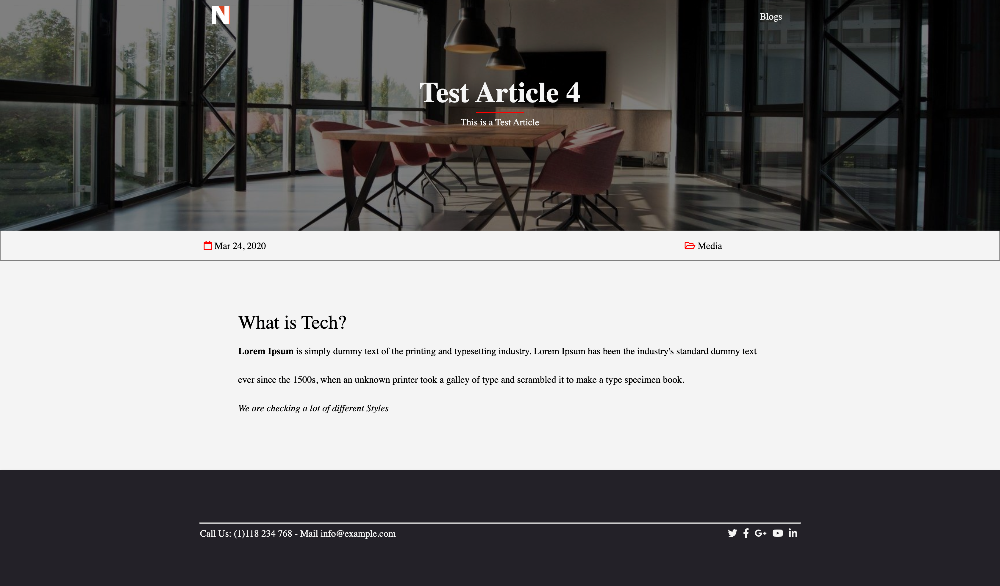

# Minimalist Blogging Theme

> Welcome to Neuro, Responsive and Minimal Personal Theme. Create Blog, News and Article with Maximum Flexibility.

> Home Page


> Blog Page



## Table of Contents

- [Installation](#installation)
- [Contributing](#contributing)

---

## Installation

- Make sure you have NodeJS and NPM installed.

### Clone

- Clone this repo to your local machine using `https://github.com/scriptjumper/minimalist-blogging-theme.git`

### Setup

> After Cloning the repo change directories into the folder and install all the required packages

```shell
$ cd minimalist-blogging-theme
$ npm i
```

> now that all the packages is installed we run the app with

```shell
$ npm start
```

---

## Contributing

> To get started...

### Step 1

- **Option 1**

  - 🍴 Fork this repo!

- **Option 2**
  - 👯 Clone this repo to your local machine using `https://github.com/scriptjumper/minimalist-blogging-theme.git`

### Step 2

- **HACK AWAY!** 🔨🔨🔨

### Step 3

- 🔃 Create a new pull request using <a href="https://github.com/scriptjumper/minimalist-blogging-theme/compare/" target="_blank">`https://github.com/scriptjumper/minimalist-blogging-theme/compare/`</a>.

---
